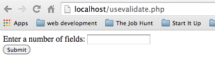
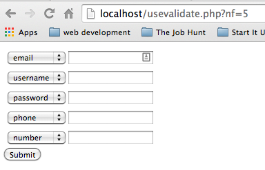
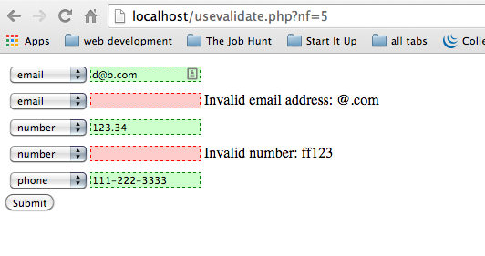

# Milestone #3 PHP Project: Daniel's Super Duper Validator Testor

## Contents:
- [Description](#description)
- [State Details](#state-details)
- [Validation Details](#validation-details)
- [Implementation Suggestions](#implementation)
- [FAQ](#faq)

## Description:
In this project you will build upon what you've learned about forms and building HTML elements dynamically. In
addition, you will employ the use of object-oriented classes and regular expressions to implement a set of validators.

You will build a page that tests any number of inputs against a set of input validators. The program will have
three different states:
- State 1: The request is a GET and there is no user input
  - The program will respond with a form (method="GET") that prompts the user to enter a number
- State 2: The request is a GET and there is an input for the number of fields
  - The program will respond with a form (method="POST") that has N **pairs** of input fields where N is
  the number_of_fields input.
  - Each pair will consist of one dropdown box and one text box
- State 3: The request is a POST
  - For each pair of inputs the program will validate the input in the text field according to the "type" specified in the corresponding dropdown box and then output the results of the validation.

Your project will have the following classes that will be used to perform validation of the text inputs:
- Validator: this is the parent class of all the "concrete" validator sub-classes
- EmailValidator: validate an email address
- UsernameValidator: validate a username
- PasswordValidator: validate a password
- PhoneValidator: validate a phone number
- NumberValidator: validate a number
- ValidatorFactory: create an appropriate Validator for a given input type

Don't think too much about classes or validation until we have covered them in class

Your project **must** have these two files:
- super_validator.php: this will be the main "front-end" to your project which is hit by the client
- Validator.php: this file will contain the validation related class as described in the "Validation" section of this document.

Your project **may** contain additional files if you choose. This is not a hint that you **should** have other files. It is only an allowance to have other files if you feel that they are helpful.

As far as visual aspects are concerned, this is not a "pixel perfect" project. You have full flexibility in regards to what the page looks like. That said, this project is all about writing PHP code, so don't spend a lot of time on visual aspects before your program is **fully** functional.

  
## State Details:
### State #1:
In state #1, the request is a GET with no input parameters. Your program should respond  with a form that has:
- method set to "GET"
- one text field with a name of "num_fields".
- a submit button

The form will look like this:

### State #2:
In state #2, the request is a GET and there is a "num_fields" parameter present. Your program should:
- validate that the num_fields parameter is a positive integer. If is not, your program should redisplay the state #1 form. You **may** include a message that indicates to the user that the input was not valid but this is **not** required.
- Assuming that num_fields is a positive integer, your program should respond with a form that:
  - has action set to this page **including the incoming num_fields parameter**
  - has method set to POST
  - has N **pairs** of inputs where N is the value of the num_fields parameter
  - Each pair of inputs will consist of:
    - one text field with a name of "text_N" (N is different for each pair)
    - one dropdown box with a name of "type_N" and these options:
      - email
      - username
      - password
      - phone
      - number

The form will look like this:

### State #3:

In state #3, the request will be a POST and there will be:
- a num_fields **GET** parameter
- some number of **POST** inputs named "text_N" and "type_N" where N is in the range (1..num_fields)

Your program should:
- validate the num_fields GET parameter. If it is not a positive integer, display the State 1 form
- Assuming that num_fields is a valid integer:
  - For each pair (text_N, type_N), validate the text field (text_N) according to the validation rules for type_N
  - Recreate the same form from State 2 with these additions:
    - All of the dropdowns should have the values from the input pre-selected
    - For each text field:
      - If the text is valid your program will:
        - populate the text field with the input value
        - add some kind of CSS styling that indicates that the value is valid
      - If the text is **NOT** valid your program will: 
        - leave the text field blank and have an error message to its right that includes the erroneous value
        - add some kind of CSS styling that indicates that the value is **NOT** valid

The form will look like this:

## Validation Details
### Validation Specifications:
- email:
  - must contain one and only one '@' character
  - there must be at least one character to the left of the '@'
  - to the right of the '@' there must be one or more alpha characters, a '.', then upto 5 alpha characters
- username:
  - must be at 4-6 characters long
  - must contain only alpha-numeric characters and '-' or '_'
- password:
  - must be 4-12 characters long
  - must contain alpha AND numeric characters and optionally contain any of [!@#$%^&*()<>?]
- phone number:
  - must be of this format: NNN-NNN-NNNN where each N is a decimal digit
- number:
  - must contain at one or more digits
  - may contain a '.', but not as the last character
  - may contain a '-' as the first character

### Validation Classes:
This section will be completed when we cover classes in class

## Implementation Suggestions

### General Suggesions
- get started NOW!
- start simple, do the simplest thing you can to get started, then move onto the next simplest thing, repeat...
- test your program after each step above
- use git. checkin your code each time you get something working
- ask questions, don't get stuck

### Order of Things:
1. don't worry about validation or classes to begin with. Start building the forms and making them work
2. Build a State #2 form with a fixed number of fields and make it work such that you can post it and get a response that has all of the fields pre-populated with their previous values
3. Add the State #1 form and make the number of fields in the State #2 form dynamic
4. Create a data structure to hold input names, values, & validity
5. Use above data structure to conditionally attach a css class to the inputs when you create them
6. Write the Validator class and **one** sub-class
7. Integrate the one sub-class into your project
8. Write the ValidatorFactory class
9. Integrate the ValidatorFactory class into your project
10. One by one, write another Validator sub-class, add it to the Factory, then integrate it into your project
11. Smile and be very proud of yourself, you have just completed a **real** project!
      

## FAQs
### Q:
A:
